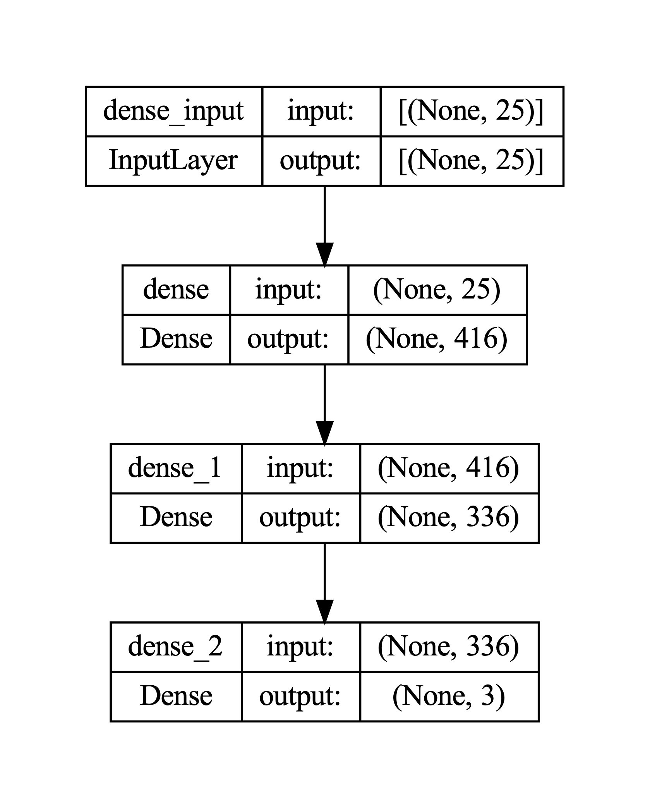
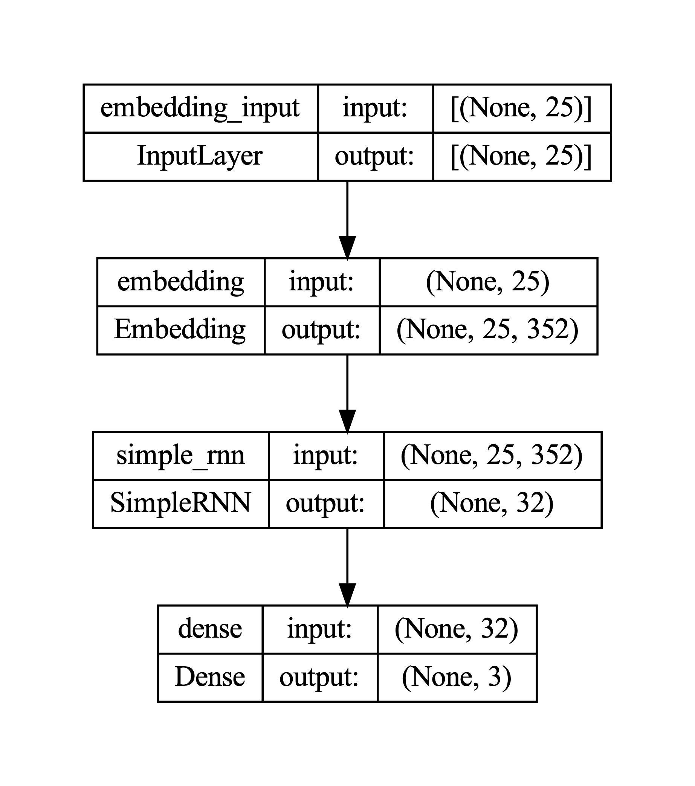
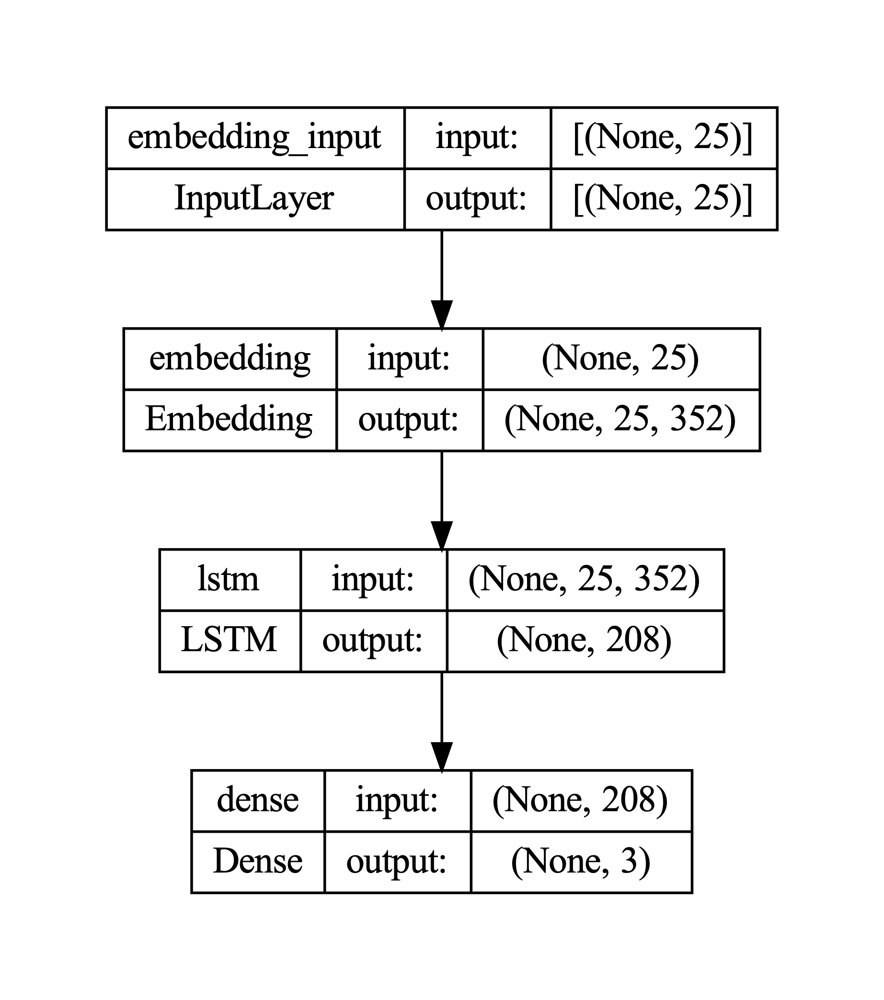
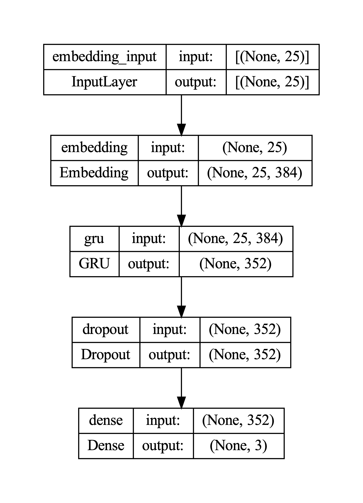

# Evaluating Sequence Learning Models for Identifying Hate Speech using Explainable AI


Welcome to this GitHub repository! Please be aware that this repository contains hate speech and offensive language, as it is part of a study focused on Explainable AI in Identifying Hate Speech. The aim is to develop and evaluate AI models that can effectively detect and explain hate speech content. By providing the necessary resources, data, and code, this repository serves as a valuable resource for further research and advancements in the field of hate speech detection and explainable AI. Please proceed with caution and use the materials responsibly.


This repository contains the code and resources for the master thesis "Evaluating Sequence Learning Models for Identifying Hate Speech using Explainable AI" (2023)

Author: Amir Mozahebi


## Repository Content:

### 1. Notebooks:
The `notebooks` folder contains Jupyter Notebooks created during the studies.


| Notebook  | Description  |
|:----------|:----------|
| [preprocessing-balanced.ipynb](https://github.com/AmirCodeHub/HateXAI-SeqLearn/blob/main/notebooks/preprocessing/preprocessing-balanced.ipynb)  | This Python notebook combines and preprocesses three hate speech datasets, preparing them for AI model training in hate speech detection |
| [validation_dataset_preprocessing.ipynb](https://github.com/AmirCodeHub/HateXAI-SeqLearn/blob/main/notebooks/preprocessing/validation_dataset_processing.ipynb)   |  This Python notebook preprocesses the test dataset, applying the same preprocessing procedure used on the training dataset ([preprocessing-balanced.ipynb](https://github.com/AmirCodeHub/HateXAI-SeqLearn/blob/main/notebooks/preprocessing/preprocessing-balanced.ipynb)). **This dataset, containing 2,700 samples, is not crucial for the conducted study, as it is intended for casual testing rather than model validation**|
| [dataset_word_analysis.ipynb](https://github.com/AmirCodeHub/HateXAI-SeqLearn/blob/main/notebooks/preprocessing/dataset_word_analysis.ipynb)   |  This Python notebook provides code for analyzing word occurrences in the training dataset, including the generation of wordcloud plots for intuitive visualization of prominent words and patterns within the text data |
| [train_ann.ipynb](https://github.com/AmirCodeHub/HateXAI-SeqLearn/blob/main/notebooks/model_training/train_ann.ipynb)  | This Python notebook builds and trains multiple **ANN** models using the Keras API, optimizing hyperparameters with Bayesian Optimization for enhanced performance|
| [train_rnn.ipynb](https://github.com/AmirCodeHub/HateXAI-SeqLearn/blob/main/notebooks/model_training/train_rnn.ipynb)     | This Python notebook builds and trains multiple **RNN** models using the Keras API, optimizing hyperparameters with Bayesian Optimization for enhanced performance.|
| [train_lstm.ipynb](https://github.com/AmirCodeHub/HateXAI-SeqLearn/blob/main/notebooks/model_training/train_lstm.ipynb)     | This Python notebook builds and trains multiple **LSTM** models using the Keras API, optimizing hyperparameters with Bayesian Optimization for enhanced performance. |
| [train_gru.ipynb](https://github.com/AmirCodeHub/HateXAI-SeqLearn/blob/main/notebooks/model_training/train_gru.ipynb) | This Python notebook builds and trains multiple **GRU** models using the Keras API, optimizing hyperparameters with Bayesian Optimization for enhanced performance.   |
| [model_performance_comparison.ipynb](https://github.com/AmirCodeHub/HateXAI-SeqLearn/blob/main/notebooks/model_evaluation/model_performance_comparison.ipynb)    |  This Python notebook enables the comparison of trained ANN, RNN, LSTM, and GRU models by plotting confusion matrices and calculating metrics such as **Precision**, **Recall**, **F1 Score**, and **Accuracy**. This offers valuable insights into each model's performance |
| [xai_comparison_notebook.ipynb](https://github.com/AmirCodeHub/HateXAI-SeqLearn/blob/main/notebooks/model_evaluation/xai_comparison_notebook.ipynb)    | This Python notebook assesses LSTM, GRU and ANN models on selected hate speech and offensive language data samples using the XAI method **LIME** ([Ribero et. al.](https://arxiv.org/abs/1602.04938)). The notebook provides valuable insights into the explainability of each model's predictions. **Please note** that this file has been uploaded using Git Large File Storage (LFS) due to its larger size    |


### 2. Datasets:
The `data` folder contains the three datasets used within the study.


* [hatespeech_multiclass_data.csv](https://github.com/AmirCodeHub/HateXAI-SeqLearn/blob/main/data/hatespeech_multiclass_data.csv): This Kaggle dataset ([source](https://www.kaggle.com/datasets/mrmorj/hate-speech-and-offensive-language-dataset)) features text data labeled as Hate Speech, Offensive Language, or Neither, providing a useful resource for model training in detecting offensive content.
* [sentiment_analysis_hate_speech.csv](https://github.com/AmirCodeHub/HateXAI-SeqLearn/blob/main/data/sentiment_analysis_hate_speech.csv): This dataset ([source](https://www.kaggle.com/datasets/arkhoshghalb/twitter-sentiment-analysis-hatred-speech)) contains text data labeled as Hate Speech or No Hate Speech, offering a practical resource for training models to identify hate speech.
* [dynamically_generated_hate_speech.csv](https://github.com/AmirCodeHub/HateXAI-SeqLearn/blob/main/data/dynamically_generated_hate_speech.csv): This dataset ([source](https://www.kaggle.com/datasets/usharengaraju/dynamically-generated-hate-speech-dataset)) contains dynamically created Hate Speech and Non-Hate Speech data, designed to improve the detection of online hate speech.


### 3. Models

| Model  | Keras Architecture  | Validation Accuracy |
|:----------|:----------|:----------|
| ANN    |     | 44.4%   |
| RNN   |       |   84.0%  |
| LSTM    |      |   85.3%  |
| GRU    |    | 84.1%  |


## Citation Note

If you use the materials in this repository, please cite the following reference:

```bibtex
@mastersthesis{mozahebi2023evaluating,
  author       = {Amir Mozahebi},
  title        = {Evaluating Sequence Learning Models for Identifying Hate Speech using Explainable AI},
  school       = {Rosenheim Technical University of Applied Sciences},
  year         = 2023
}
